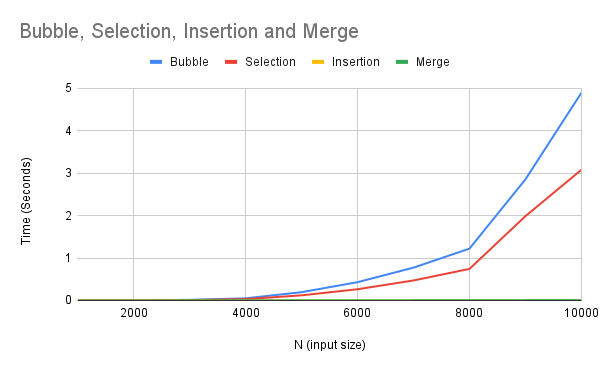

# Sort Analysis Data

## Results Table
Make sure to go out to at least 100,000 (more are welcome), and you have 10 different values (more welcome). You are welcome to go farther, but given 100,000 can take about 20 seconds using a selection sort on a fast desktop computer, and 200,000 took 77 seconds, you start having to wait much longer the more 0s you add. However, to build a clearer line, you will want more data points, and you will find merge and quick are able to handle higher numbers easier (but at a cost you will explore below). 

You are free to write a script to run the program and build your table (then copy that table built into the markdown). If you do that, please include the script into the repo.  Note: merge and quick sorts are going to be explored in the team activity for Module 06. You can start on it now, but welcome to wait.

 

### Table [^note]
| N     | Bubble  | Selection | Insertion  | Merge | 
| :---: | :----:  | :-----: | :-------:  | :--:  | 
|  1000 |0.000705 |0.000366 |0.000008   |0.000065 
|  2000 |0.002632 |0.001428 |0.000010   |0.000134 
|  3000 |0.014299 |0.009000 |0.000076   |0.000376 
|  4000 |0.049880 |0.030941 |0.000041   |0.000820 
|  5000 |0.194597 |0.120142 |0.000015   |0.001727 
|  6000 |0.430533 |0.264020 |0.000014   |0.002567 
|  7000 |0.772977 |0.471018 |0.000013   |0.003247 
|  8000 |1.221679 |0.743435 |0.000010   |0.004154 
| 9000  |2.854018 |1.986235 |0.000050   |0.006173 
| 10,000|4.896290 |3.080039 |0.000009   |0.008553 

## BigO Analysis  / Questions

### 1. Build a line chart
Build a line chart using your favorite program. Your X axis will be N increasing, and your Y access will be the numbers for each type of sort. This will create something similar to the graph in the instructions, though it won't be as smooth. Due to speed differences, you may need to break up the $O(\log n)$ and $O(n^2)$ into different charts.

Include the image in your markdown. As a reminder, you save the image in your repo, and use [image markdown].

### Sorts Line Chart

### 2. Analysis
Looking at the graph and the table, what can you say about the various sorts? Which are the fastest? Which are the slowest? Which are the most consistent? Which are the least consistent? Use this space to reflect in your own words your observations.

- Looking at the graph and table, I can see that merge and quick sorts are the fastest sorts because their times stay pretty low even when the list gets bigger. The bubble, belection, and insertion sorts are way slower, especially when the numbers get large. Merge sort looks the most steady because it grows nice and smooth, and quick sort is usually fast but can change a bit depending on the data. The others are less consistent and take a lot longer as the list gets bigger.

### 3. Big O
Build another table that presents the best, worst, and average case for Bubble, Selection, Insertion, Merge, and Quick. You are free to use resources for this, but please reference them if you do. 

### Table [Best/Avg/Worst Cases]
| Algo        | Best Case | Avg Case  | Worst Case  
| :---:       | :----:    | :-----:   | :-------:  | 
|  Bubble     |0(n)       |O(n^2)     |O(n^2)      |
|  Selection  |O(n^2)     |O(n^2)     |O(n^2)      | 
|  Insertion  |0(n)       |O(n^2)     |O(n^2)      |
|  Merge Sort |O(n log n) |O(n log n) |O(n log n)  |
|  Quick Sort |O(n log n) |O(n log n) |O(n^2)      |

#### 3.2 Worst Case
Provide example of arrays that generate _worst_ case for Bubble, Selection, Insertion, Merge Sorts

- bubble sort: worst case is when the array is in reverse order, like [5,4,3,2,1] because it has to swap every single pair many times.
- selection sort:actually always does the same number of comparisons no matter what, so even something like [5,4,3,2,1]is still the worst
- insertion sort:lso worst when the array is reversed, like [9,8,7,6,5,4,3,2,1] becasue each number has to move to the front
- merge sort:i wouldnt say merge sort has a worst case becsaue it always splits and merges the same way which makes it pretty consistent no matter what way it is put

#### 3.3 Best Case
Provide example of arrays that generate _best_ case for Bubble, Selection, Insertion, Merge Sorts 

- bubble sort: best case is when an array is sorted  and ends fast since there are no swaps, ex.[1,2,3,4,5]
- selection sort: there is no best case in selection sort since each value gets checked regardless if it's sorted or not sorted [1,2,3,4,5]
- insertion sort: best case is when the array is sorted and also ends early since there is no need to change places, ex [1,2,3,4,5]
- merge sort: there is no best case for this sort either. Same amount of work in splitting and merging , ex.[1,2,3,4,5]

#### 3.4 Memory Considerations
Order the various sorts based on which take up the most memory when sorting to the least memory. You may have to research this, and include the mathematical notation. 

- merge sort: Uses the most memory, because it needs extra space to hold the temporary subarrays while merging. Space Complexity: O(n)
- insertion sort: works mostly in place, only a few variables are used to shift elements. space complexity: O(1)
- selection sort: an in-place sort, it just swaps elements and doesn’t need extra storage. space complexity: O(1)
- bubble sort: same as insertion and selection sort where it only swaps in place with no extra arrays. space complexity: O(1)

### 4. Growth of Functions
Give the following values, place them correctly into *six* categories. Use the bullets, and feel free to cut and paste the full LatexMath we used to generate them.  

#### Categories
* Constant Time: $100$ , $10000$  
* Linear Time: $3n$,$100n$ 
* Log-linear time: $n\log_2n$
* Quadratic time: $n^2$ , $5n^2+5n$  
* Exponential time: $2^{(n-1)}$ , $2^n$ 
* Factorial time: $n!$ 

### 5. Growth of Function Language

Pair the following terms with the correct function in the table. 
* Constant, Logarithmic, Linear, Quadratic, Cubic, Exponential, Factorial

### Table [Big O and Fuunctions]
| Big $O$      |  Name          |
| ------       | ------         |
| $O(n^3)$     |  Cubic         |
| $O(1)$       | Constant       |
| $O(n)$       | Linear         |
| $O(\log_2n)$ | Logarithmic    |
| $O(n^2)$     | Quadratic      |
| $O(n!)$      | Factorial      |
| $O(2^n)$     | Exponential    |

### 6. Stable vs Unstable
Look up stability as it refers to sorting. In your own words, describe one sort that is stable and one sort that isn't stable  

- When talking about stability in sorting, this means if two items have the same value, a stable sort keeps them in the same order they were originally in. An example of a stable sort is the merge sort since it keeps the same amount of elements in their original order because at the end it merges each batch of elements back together carefully. An unstable sort would be selection sort becasue it does not think of the original order, and moves an equal amount of elements around since it swaps elements based on the smallest value.

### 6.2 When stability is needed?
Explain in your own words a case in which you will want a stable algorithm over an unstable. Include an example. 

- Stability really matters when you care about the original order of equal items. An example would be sorting a list of kids at a daycare, first sort them by what grade the child is in then get their name. If you use a stable sort like merge sort for the grade they are in, the children would stay in their dedicated grades. But if you use an unstable sort like selection, the order could get mixed up. In other words, I would want a stable algorithm when there are multiple levels of sorting methods going on to keep everything consistent.

### 7. Gold Thief

You are planning a heist to steal a rare coin that weighs 1.0001 ounces. The problem is that the rare coin was mixed with a bunch of counter fit coins. You know the counter fit coins only weight 1.0000 ounce each. There are in total 250 coins.  You have a simple balance scale where the coins can be weighed against each other. Hint: don't think about all the coins at once, but how you can break it up into even(ish) piles. 

#### 7.1 Algorithm
Describe an algorithm that will help you find the coin. We encourage you to use pseudo-code, but not required.

- split 250 coins into 4 equal piles
- compare 2 piles at a time: weigh Pile 1 against Pile 2
    - depending on the weight, one pile will be heaviest 
    - if one pile is heavier, that pile will contain the rare coin
    - if the weight is equal or scale balances, continue to check Pile 3 and Pile 4
- repeat weighing the heaviest piles in half 
- keep weighing the piles that get smaller and smaller when splitting in half
- one coin will remain which will be the rare coin

#### 7.2 Time Complexity
What is the average time complexity of your algorithm? 

- since each weighing step reduces the amount of coin by 4, the log 4(n), n = amount of coins
- $\log_4(250)$ would be 4-5 weighings to find the rare coin.

## Technical Interview Practice Questions

For both these questions, are you are free to use what you did as the last section on the team activities/answered as a group, or you can use a different question.

1. Select one technical interview question (this module or previous) from the [technical interview list](https://github.com/CS5008-khoury/Resources/blob/main/TechInterviewQuestions.md) below and answer it in a few sentences. You can use any resource you like to answer the question.

- When would we want an algorithm with a higher time complexity than another faster algorithm? 
- I would want an algorithm with a higher time complexity depending on the task at hand. A faster algorithm might be quick, but could take up more memory, or it might be harder to understand and maintain. In those cases, we might pick a higher time complexity one that’s simpler or more reliable. A great example of this would be if there was an algorithm that is O(n²) but easy to code and debug, and another is O(n log n) but is very complicated to debug and full of messy edge cases.

2. Select one coding question (this module or previous) from the [coding practice repository](https://github.com/CS5008-khoury/Resources/blob/main/LeetCodePractice.md) and include a c file with that code with your submission. Make sure to add comments on what you learned, and if you compared your solution with others. 

- In Group Lab document

## Deeper Thinking
Sorting algorithms are still being studied today. They often include a statistical analysis of data before sorting. This next question will require some research, as it isn't included in class content. When you call `sort()` or `sorted()` in Python 3.6+, what sort is it using? 

- When calling sort() or sorted(), it uses an algorithm called Timsort, which is a hybrid sorting algorithm that uses both merge sort and insertion sort to make ure of the patterns that already exist within the data. 

#### Visualize
Find a graphic / visualization (can be a youtube video) that demonstrates the sort in action. 

### Timsort Visualization Video (click below)

#### Big O
Give the worst and best case time-complexity, and examples that would generate them. 

- Worst case time complexity: O(n log n), this happens when the data is not sorted or in reverse, Ex. [6,5,4,3,2,1]
- Best case time complexity: O(n), this happens when the data is already sorted or almost sorted, Ex. [1,2,3,4,5,6]

## References
Add your references here. A good reference includes an inline citation, such as [1] , and then down in your references section, you include the full details of the reference. Use [ACM Reference format].

1. “Analysis of Different Sorting Techniques.” GeeksforGeeks, 2025. GeeksforGeeks. Retrieved Aug. 2025 from https://www.geeksforgeeks.org/dsa/analysis-of-different-sorting-techniques/
2. “Introduction to Algorithms.” MIT Press, 2009. MIT Press. Retrieved Oct. 2025 from https://mitpress.mit.edu/9780262033848/introduction-to-algorithms/
3. “Time Complexity and Big O Notation (with Examples).” GeeksforGeeks, 2025. GeeksforGeeks. Retrieved Oct. 2025 from https://www.geeksforgeeks.org/time-complexity-and-big-o-notation/
4. “Analysis of Algorithms – Growth of Functions.” Tutorialspoint, 2025. Tutorialspoint. Retrieved Oct. 2025 from https://www.tutorialspoint.com/analysis_of_algorithms/analysis_of_algorithms_growth_of_functions.html
5. “Big-O Notation.” Khan Academy, 2025. Khan Academy. Retrieved Oct. 2025 from https://www.khanacademy.org/computing/computer-science/algorithms/asymptotic-notation/a/big-o-notation
6. “Big O Notation.” Wikipedia, The Free Encyclopedia, 2025. Wikipedia. Retrieved Oct. 2025 from https://en.wikipedia.org/wiki/Big_O_notation
7. “Stable and Unstable Sorting Algorithms.” GeeksforGeeks, 2025. GeeksforGeeks. Retrieved Oct. 2025 from https://www.geeksforgeeks.org/stability-in-sorting-algorithms/
8. “Sorting Algorithm Stability.” Tutorialspoint, 2025. Tutorialspoint. Retrieved Oct. 2025 from https://www.tutorialspoint.com/data_structures_algorithms/sorting_algorithms_stability.html
9. “Merge Sort.” Wikipedia, The Free Encyclopedia, 2025. Wikipedia. Retrieved Oct. 2025 from https://en.wikipedia.org/wiki/Merge_sort
10. “Selection Sort.” Khan Academy, 2025. Khan Academy. Retrieved Oct. 2025 from https://www.khanacademy.org/computing/computer-science/algorithms/sorting-algorithms/a/selection-sort
11. “When to Use Stable Sorting Algorithms.” GeeksforGeeks, 2025. GeeksforGeeks. Retrieved Oct. 2025 from https://www.geeksforgeeks.org/stability-in-sorting-algorithms/
12. “Stable vs Unstable Sorting.” Tutorialspoint, 2025. Tutorialspoint. Retrieved Oct. 2025 from https://www.tutorialspoint.com/data_structures_algorithms/sorting_algorithms_stability.html
13. “Merge Sort.” Wikipedia, The Free Encyclopedia, 2025. Wikipedia. Retrieved Oct. 2025 from https://en.wikipedia.org/wiki/Merge_sort
14. “Sorting HOWTO.” Python Software Foundation, 2025. Python.org. Retrieved Oct. 2025 from https://docs.python.org/3/howto/sorting.html
15. “Tim Peters — Timsort Algorithm.” Wikipedia, The Free Encyclopedia, 2025. Wikipedia. Retrieved Oct. 2025 from https://en.wikipedia.org/wiki/Timsort
16. “Python List sort() Method.” GeeksforGeeks, 2025. GeeksforGeeks. Retrieved Oct. 2025 from https://www.geeksforgeeks.org/python-list-sort-method/
17. “Sorting HOWTO.” Python Software Foundation, 2025. Python.org. Retrieved Oct. 2025 from https://docs.python.org/3/howto/sorting.html
18. “Tim Peters — Timsort Algorithm.” Wikipedia, The Free Encyclopedia, 2025. Wikipedia. Retrieved Oct. 2025 from https://en.wikipedia.org/wiki/Timsort
19. “Python List sort() Method.” GeeksforGeeks, 2025. GeeksforGeeks. Retrieved Oct. 2025 from https://www.geeksforgeeks.org/python-list-sort-method/

## Footnotes:
[^note]: You will want at least 10 different N values, probably more to see the curve for Merge and Quick. If bubble, selection, and insertion start to take more than a  minute, you can say $> 60s$ or - . For example 
    | N | Bubble | Selection | Insertion | Merge | Quick |
    | :-- | :--: | :--: | :--: | :--: | :--: |
    | 10,000|0.197758|0.070548|0.000070|0.000513|0.000230|
    |100,000|-|-|-|0.131061|0.018602|

<!-- links moved to bottom for easier reading in plain text (btw, this a comment that doesn't show in the webpage generated-->
[image markdown]: https://docs.github.com/en/get-started/writing-on-github/getting-started-with-writing-and-formatting-on-github/basic-writing-and-formatting-syntax#images

[ACM Reference Format]: https://www.acm.org/publications/authors/reference-formatting
[IEEE]: https://www.ieee.org/content/dam/ieee-org/ieee/web/org/conferences/style_references_manual.pdf